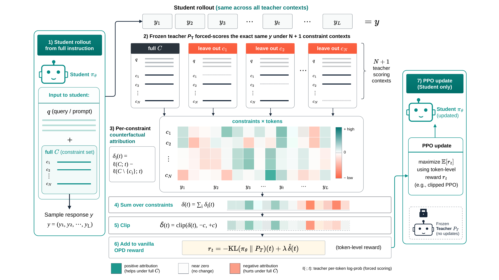

# CC-OPD

**Counterfactual Constraint-Conditioned On-Policy Distillation for Multi-Constraint Instruction Following** (EMNLP 2026).

## The idea

A single instruction can ask for a particular format, length, style, and content at the same time. Vanilla on-policy distillation (OPD) scores a student's response with a frozen teacher conditioned on the full instruction. CC-OPD also asks the teacher to score that *same response* after removing one constraint at a time. The change in each token's log-probability gives a signal for that constraint. We sum these signals, clip the sum, and add it to the vanilla sampled-token OPD reward. The student always sees the full instruction; the teacher remains frozen.

*Figure: The same student rollout is scored under the full instruction and each leave-one-out teacher context.*

## Paper results

CC-OPD has the highest seven-benchmark average among the student-training methods evaluated in the paper. The table below compares the two methods implemented in this repository, using the paper's GRPO-IR-trained teachers. Scores are instruction-level accuracy averaged over IFEval, IFBench, MulDimIF, ComplexBench, InfoBench, FollowBench, and CFBench.

| Student / frozen teacher | Vanilla OPD (%) | CC-OPD (%) | Gain |
|---|---:|---:|---:|
| Qwen2.5-1.5B / Qwen2.5-7B | 47.6 | **51.4** | +3.8 pp |
| Qwen3-4B / Qwen3-4B | 61.9 | **64.3** | +2.4 pp |

On MulDimIF, the Qwen2.5-1.5B student trained with CC-OPD reaches **72.9%**, above its 7B teacher's **70.1%**. These are results reported in the paper, not scores generated by the repository's smoke tests.

## METHOD

| `OPD_METHOD` | Training objective | Default horizon |
|---|---|---|
| `loo` | CC-OPD: sampled-token OPD plus leave-one-out teacher scoring and clipped constraint shaping. | 1,500 verl-steps |
| `opd` | Vanilla sampled-token OPD; no counterfactual teacher scoring. | Up to 6,000 verl-steps; the paper reports the selected 3,000-step checkpoint. |

~~~text
.
├── assets/       Paper's CC-OPD pipeline figure
├── code/         Verl-based trainer, LOO scoring, and OPD reward
└── training/     Launchers, data preparation, evaluation adapters, and smoke checks
~~~

The main implementation is in [`cc_opd.py`](code/verl/trainer/ppo/cc_opd.py) (leave-one-out teacher prompts and scoring) and [`core_algos.py`](code/verl/trainer/ppo/core_algos.py) (sampled-token reward and actor loss). See the [implementation guide](code/README.md) for the training path.

## Getting started

Use Python 3.10+ on a CUDA machine and follow the [installation and data-preparation guide](training/README.md). Supply a student checkpoint, a frozen teacher checkpoint, a training parquet, and a validation parquet. To reproduce the paper's LOO prompt construction, prepare the training parquet from the teacher-aligned HIR JSONL with [`prepare_hir16k_teacher_aligned.py`](training/scripts/prepare_hir16k_teacher_aligned.py); that JSONL is not included here.

From the `training/` directory:

~~~bash
cp env.example.sh env.sh
# Set STUDENT_MODEL_PATH, TEACHER_MODEL_PATH, TRAIN_DATA, and VAL_DATA in env.sh.
source env.sh

CC_OPD_PRINT_CONFIG_ONLY=true bash run_cc_opd.sh  # inspect the LOO configuration
bash run_cc_opd.sh                                 # train CC-OPD
OPD_METHOD=opd bash run_cc_opd.sh                  # train vanilla OPD
~~~

The launcher uses $\lambda=2$, clip threshold $c=5$, and all available constraints ($\rho=1$) for LOO by default.

## Citation

If you use this code, please cite the paper:

~~~bibtex
@inproceedings{zheng2026ccopd,
  title     = {Counterfactual Constraint-Conditioned On-Policy Distillation for Multi-Constraint Instruction Following},
  author    = {Zheng, Yanzhao and Yu, Yuanqiang and Xu, Tianze and Ma, Chao and Zhang, Zhentao and Zhu, Jihuai and Dong, Baohua and Zhu, Hangcheng and Huang, Ruohui},
  booktitle = {Proceedings of the 2026 Conference on Empirical Methods in Natural Language Processing},
  year      = {2026}
}
~~~

## License

This release is under Apache 2.0. See [LICENSE](LICENSE) and [NOTICE](NOTICE) for the license and upstream attributions.
